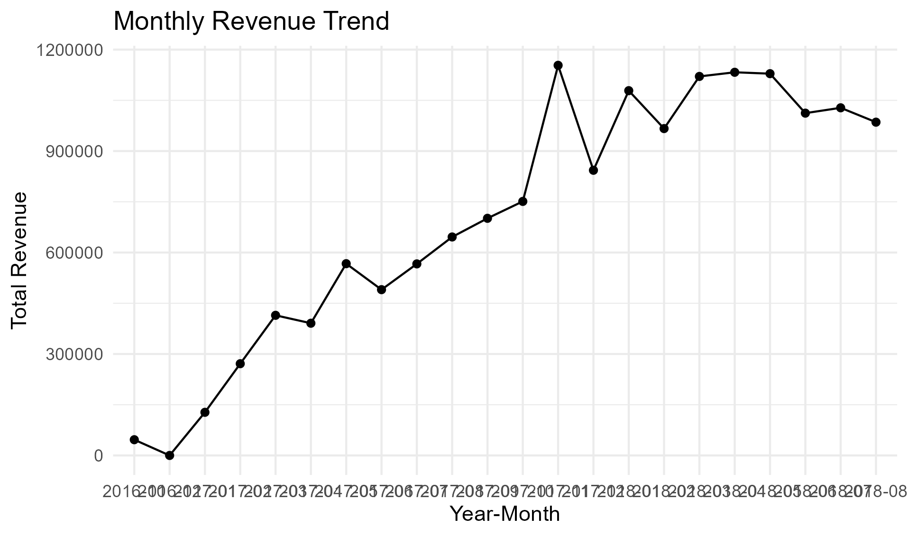

# E-Commerce-Sales-Analysis-SQL-Project-
This project analyzes transactional data from a Brazilian e-commerce company to evaluate revenue performance, customer behavior, product contribution, and payment method usage.
The analysis was conducted using SQL in Google BigQuery, applying advanced techniques such as:

Common Table Expressions (CTEs)
Multi-table JOIN operations
Window Functions (LAG, RANK, NTILE)
Customer segmentation
Month-over-Month (MoM) growth analysis
Revenue aggregation with granularity control

Business Objectives
Analyze monthly revenue trends
Identify the worst-performing month
Detect revenue concentration by product category
Identify high-value customers
Segment customers based on spending behavior
Evaluate payment method performance
Generate strategic business recommendations

Tools & Technologies
SQL
Google BigQuery
R (for data visualization)
GitHub (version control & documentation)

Dataset
The dataset used in this project is the Olist Brazilian E-commerce Dataset, which contains:

Orders
Customers
Order Items
Products
Payments

The analysis focused exclusively on delivered orders to ensure revenue accuracy.

Analysis Performed

Calculated total revenue per month
Computed Month-over-Month growth using LAG()
Identified the worst-performing month
## 📈 Monthly Revenue Trend

Top Product Categories

Aggregated revenue at product-level granularity
Corrected JOIN duplication issue by using price + freight_value
Identified revenue concentration in top categories

Customer Analysis & Segmentation

Calculated total revenue per customer
Ranked customers using RANK()
Created revenue-based segments using NTILE():
VIP (Top 10%)
Regular
Low Value

Payment Method Analysis

Identified dominant payment method
Calculated revenue share per payment type
Computed Average Order Value (AOV) by payment method

Key Finding:Credit Card is the dominant payment method in revenue, order volume, and average order value.

Key Insights

Revenue is highly concentrated in a small group of product categories.
A limited percentage of customers (VIP segment) drives a large portion of total revenue.
The business shows strong dependency on credit card payments.
Monthly revenue volatility suggests seasonal impact.

Strategic Recommendations

Implement loyalty programs targeting VIP customers.
Diversify payment incentives to reduce dependency risk.
Launch campaigns during historically weak revenue months.
Expand high-performing product categories
